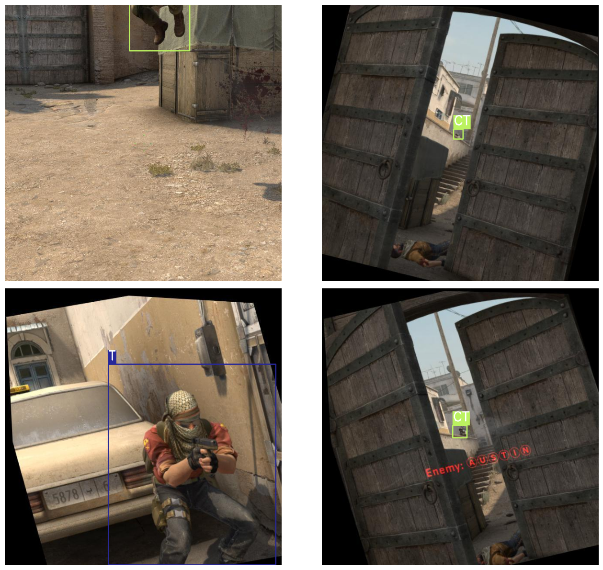
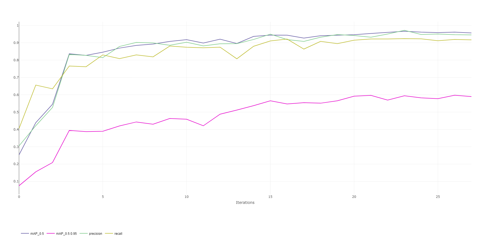
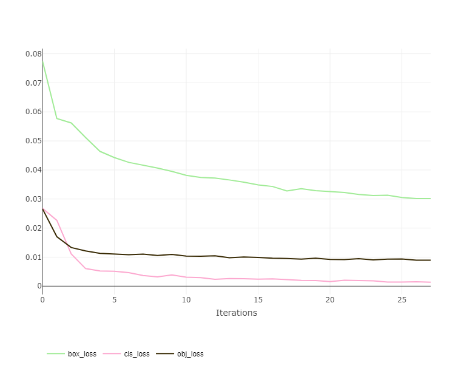
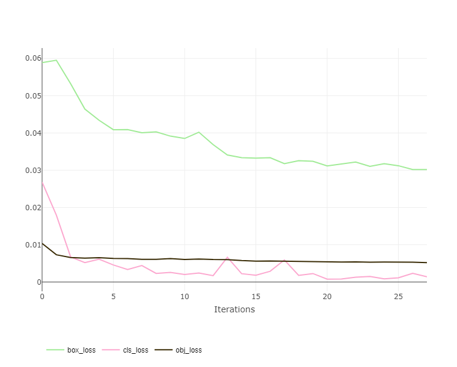

# CS:GO T/CT player model detection 🎮
Detect and classify player models from CS:GO game images
## Stack of technologies 🏗
- Python 🐍
- YOLOv5 🚀
- OpenCV 📷
- ClearML 📊
## Task description 📋
For image from CS:GO game, need to detect and classify a player model. There are 2 possible classes: Terrorist (T) and Counter-Terrorist (CT)

Examples:

## Proposed solution 💡
For this task YOLOv5 small was fine-tuned. 

As the task is not really hard, model was trained for 30 epochs using standard hyperparameters. Final quality on validation: 
- 0.956 mAP_0.5 
- 0.589 mAP_0.5:0.95
- 0.945 precision
- 0.917 recall

Quality on validation set during training:

Train loss during training:

Validation loss during training:

## How to improve 🔨
1. To increase the image processing speed on inference, you could try the lighter specification YOLOv5 Nano (Since the task is quite easy, the quality will most likely not drop much)
2. The dataset contains images prior to the game update, when new player model skins were added. You may need to add images with new character models and retrain the model to make it work stable on the current images.
